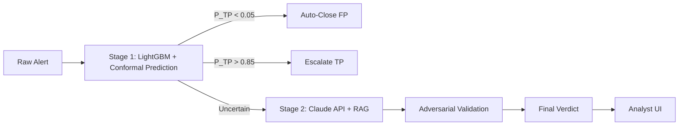

<p align="center">
  <h1 align="center">SOC False Positive Reduction</h1>
  <p align="center">A two-stage hybrid alert triage pipeline that cuts SOC false positives using ML scoring, conformal prediction, LLM reasoning, and adversarial validation.</p>
</p>

<p align="center">
  <a href="https://www.python.org/downloads/"></a>
  <a href="https://opensource.org/licenses/MIT"></a>
</p>

---

## What This Does

SOC analysts spend most of their time on false positives. This system automates triage of low-confidence alerts and surfaces only the ones that matter.



**Stage 1** scores every alert with a calibrated LightGBM classifier. Conformal prediction splits alerts into three bands with statistical guarantees: auto-close, escalate, or uncertain.

**Stage 2** takes the uncertain band and reasons over it using Claude with RAG over historical alert dispositions. It outputs a structured verdict with natural language explanation.

**Adversarial validation** runs a second LLM call (inspired by Cloudflare's Project Glasswing) that attempts to disprove Stage 2 findings before finalizing.

**Analyst UI** is a Streamlit dashboard showing alert details, SHAP explanations, LLM rationale, similar historical alerts, and feedback capture.

## Performance Targets

| Metric | Target |
|--------|--------|
| Stage 1 PR-AUC | >= 0.85 |
| Auto-FP false negative rate | <= 1% |
| True positive recall | >= 95% |
| Alert volume reduction | >= 70% |
| Stage 1 scoring latency | < 500ms/alert |
| Stage 2 LLM response time | < 10s/alert |

## Quick Start

### Prerequisites

- Python 3.11+
- CICIDS2017 dataset in `data/raw/` (see [docs/setup.md](docs/setup.md))
- Anthropic API key in `.env`

### Setup

```bash
git clone <repo-url>
cd soc-fp-reduction
python3 -m venv .venv && source .venv/bin/activate
pip install -r requirements.txt
cp .env.example .env          # then add your ANTHROPIC_API_KEY
```

### Run the pipeline (three steps)

```bash
# Step 1: Train LightGBM model and conformal predictor
# --skip-tuning runs in ~2 min; omit it for full Optuna tuning (~20-40 min)
python scripts/train_stage1.py --skip-tuning

# Step 2: Embed training data and build FAISS retrieval index
# --sample-size limits to N rows for faster demo; omit to embed all training data
python scripts/build_rag_index.py --sample-size 50000

# Step 3: Run the pipeline
# Processes the 10K demo fixture; add --no-llm to skip Claude API calls
python scripts/run_pipeline.py --input data/fixtures/fixture_10k.csv --output results/run.csv
```

### Run the dashboard (Epic 3 -- in progress)

```bash
streamlit run src/ui/dashboard.py
```

### Run tests

```bash
pytest tests/ -v --tb=short
```

## Project Structure

```
soc-fp-reduction/
├── docs/
│   ├── requirements.md            # Functional & non-functional requirements
│   ├── architecture.md            # System design & data flow
│   ├── test_plan.md               # Test specifications
│   ├── sprint_backlog.md          # Sprint plan and story status
│   ├── threat_model.md            # STRIDE threat model and security controls
│   └── setup.md                   # Full setup guide
├── src/
│   ├── data/
│   │   ├── loader.py              # CICIDS2017 loading, schema validation
│   │   └── features.py            # Feature engineering, temporal split
│   ├── models/
│   │   ├── classifier.py          # LightGBM training, Optuna tuning, evaluation
│   │   ├── conformal.py           # SplitConformalClassifier, three-band routing
│   │   ├── explainer.py           # SHAP TreeExplainer
│   │   └── integrity.py           # SHA-256 model artifact verification (S4)
│   ├── llm/
│   │   ├── adjudicator.py         # Stage 2 prompt assembly and Claude API call
│   │   ├── adversarial.py         # Adversarial prompt and reconciliation logic
│   │   ├── embeddings.py          # MiniLM-L6-v2 sentence embeddings
│   │   ├── retrieval.py           # FAISS index build, save, load, query
│   │   ├── sanitizer.py           # Prompt injection mitigation (S1)
│   │   ├── validators.py          # Pydantic schemas for LLM outputs (S5)
│   │   ├── redactor.py            # Field allowlist before API calls (S6)
│   │   ├── rate_limiter.py        # Rate limiting and circuit breaker (S7)
│   │   ├── graphs/
│   │   │   ├── adjudicator_graph.py  # LangGraph StateGraph for Stage 2
│   │   │   └── adversarial_graph.py  # LangGraph StateGraph for adversarial
│   │   └── a2a/
│   │       ├── client.py             # A2A inprocess client
│   │       └── agent_cards/          # A2A agent card JSON files
│   ├── pipeline/
│   │   ├── orchestrator.py        # End-to-end pipeline wiring
│   │   └── tripwire.py            # Retroactive IOC check with file persistence
│   ├── utils/
│   │   ├── secrets.py             # API key loading and log redaction (S2)
│   │   └── audit.py               # SHA-256 hash-chained audit log (S3)
│   └── ui/
│       └── dashboard.py           # Streamlit analyst dashboard (Epic 3)
├── scripts/
│   ├── download_data.py           # CICIDS2017 download helper
│   ├── train_stage1.py            # Train LightGBM + fit conformal predictor
│   ├── build_rag_index.py         # Embed training data, build and save FAISS index
│   └── run_pipeline.py            # Production entry point: load artifacts, process alerts
├── tests/
│   ├── conftest.py                # Shared fixtures (10K subset, mock Anthropic client)
│   ├── test_epic1_data.py         # Data, feature engineering, classifier tests
│   ├── test_epic2_llm.py          # Conformal, RAG, LLM adjudication, pipeline tests
│   ├── test_epic3_ui.py           # Dashboard tests (Epic 3)
│   └── test_security.py           # Security control tests (S1-S7)
├── data/
│   ├── raw/                       # CICIDS2017 CSVs (not committed)
│   └── fixtures/                  # 10K stratified subset (committed for CI)
├── models/                        # Trained artifacts (not committed)
│   ├── stage1_model.pkl           # LightGBM model (after train_stage1.py)
│   ├── conformal.pkl              # Conformal predictor (after train_stage1.py)
│   ├── faiss_index.bin            # FAISS index (after build_rag_index.py)
│   ├── training_df.parquet        # Training rows for RAG label lookups
│   ├── tripwire.jsonl             # Persistent auto-FP store (append-only)
│   └── checksums.json             # SHA-256 hashes for all model artifacts
├── config.yaml                    # All configuration -- no secrets
├── .env                           # Secrets (not committed)
├── .env.example                   # Template (committed)
└── requirements.txt               # Python dependencies
```

## Epic Status

| Epic | Description | Status |
|------|-------------|--------|
| 1 | Data Ingestion & Stage 1 Classifier | Complete |
| 2 | Conformal Calibration & Stage 2 LLM | Complete |
| 3 | Analyst UI & Demo | In progress |

**Test count**: 103 tests passing (Epics 1 + 2 + security).

## Configuration Reference

All runtime parameters are in `config.yaml`. No operational values are hardcoded in source files.

| Section | Key | Default | Description |
|---------|-----|---------|-------------|
| `data` | `raw_dir` | `data/raw` | Directory containing CICIDS2017 CSV files |
| `data` | `test_day` | `5` | Day number used as temporal hold-out (Friday) |
| `stage1` | `model_artifact_path` | `models/stage1_model.pkl` | Trained LightGBM output path |
| `stage1` | `shap_top_k` | `5` | Number of top SHAP features included in Stage 2 prompts |
| `stage1` | `is_unbalance` | `true` | LightGBM class imbalance handling |
| `tuning` | `n_trials` | `50` | Optuna trial budget |
| `tuning` | `convergence_patience` | `20` | Trials without improvement before early stop |
| `tuning` | `convergence_delta` | `0.001` | Minimum PR-AUC gain to count as improvement |
| `tuning` | `calibration_split` | `0.2` | Fraction of training data held out for conformal calibration |
| `conformal` | `alpha` | `0.05` | Miscoverage rate; gives 95% coverage guarantee |
| `conformal` | `artifact_path` | `models/conformal.pkl` | Conformal predictor output path |
| `stage2` | `model` | `claude-sonnet-4-20250514` | Claude model for Stage 2 adjudication |
| `stage2` | `max_tokens` | `2048` | Max tokens per Stage 2 response |
| `stage2` | `temperature` | `0.1` | Stage 2 temperature (low for determinism) |
| `stage2` | `timeout_seconds` | `10` | Anthropic API call timeout |
| `adversarial` | `model` | `claude-sonnet-4-20250514` | Claude model for adversarial pass |
| `adversarial` | `temperature` | `0.3` | Adversarial temperature (higher for diversity) |
| `adversarial` | `confidence_threshold_high` | `0.80` | Stage 2 confidence above which it wins on disagreement |
| `rag` | `embedding_model` | `sentence-transformers/all-MiniLM-L6-v2` | Embedding model name |
| `rag` | `top_k` | `5` | Number of similar historical alerts to retrieve |
| `rag` | `faiss_index_path` | `models/faiss_index.bin` | FAISS index output path |
| `rag` | `training_df_path` | `models/training_df.parquet` | Training DataFrame for RAG label lookups |
| `rag` | `embedding_batch_size` | `64` | Batch size for SentenceTransformer encode() |
| `rag` | `device` | `auto` | Embedding device: `auto` (CUDA if available), `cpu`, or `cuda` |
| `agents` | `max_retries` | `3` | LangGraph retry attempts before fallback to needs_review |
| `agents` | `retry_base_delay_seconds` | `1.0` | Exponential backoff base delay |
| `agents` | `retry_max_delay_seconds` | `30.0` | Exponential backoff cap |
| `tripwire` | `lookback_days` | `7` | IOC retroactive check window in days |
| `a2a` | `mode` | `inprocess` | Agent invocation mode: `inprocess` or `http` |

## Security Controls

| Control | Module | What It Does |
|---------|--------|--------------|
| S1: Prompt injection | `src/llm/sanitizer.py` | Strips control chars and injection phrases; XML-delimited data sections |
| S2: Secrets | `src/utils/secrets.py` | API key validation; log redaction filter replacing `sk-ant-...` with `[REDACTED]` |
| S3: Audit chain | `src/utils/audit.py` | Append-only JSON Lines audit log with SHA-256 hash chain |
| S4: Model integrity | `src/models/integrity.py` | SHA-256 hash saved at training time; verified at every load |
| S5: LLM validation | `src/llm/validators.py` | Strict Pydantic schemas on every LLM response; fallback to `needs_review` |
| S6: Data minimization | `src/llm/redactor.py` | Field allowlist strips IPs and non-network-feature fields before API calls |
| S7: Rate limiting | `src/llm/rate_limiter.py` | Per-hour/day caps; circuit breaker on high uncertain-band rate; exponential backoff |
| S8: Dashboard auth | `src/ui/dashboard.py` | Role-based access (viewer/analyst); session timeout |

Full threat model: [docs/threat_model.md](docs/threat_model.md).

## Tech Stack

| Component | Technology |
|-----------|-----------|
| ML Classifier | LightGBM, scikit-learn |
| Hyperparameter tuning | Optuna (TPE sampler) |
| Uncertainty quantification | MAPIE (SplitConformalClassifier) |
| Explainability | SHAP TreeExplainer |
| Embeddings | sentence-transformers (MiniLM-L6-v2) |
| Vector search | FAISS |
| LLM | Anthropic Claude API |
| Agent graphs | LangGraph |
| Inter-agent protocol | A2A (inprocess mode) |
| Schema validation | Pydantic v2 |
| Data | pandas, DuckDB |
| UI | Streamlit |
| Testing | pytest |

## Dataset

[CICIDS2017](https://www.unb.ca/cic/datasets/ids-2017.html) -- 2.8M network flows, 78 features, 5-day capture (Monday--Friday, July 2017). Temporal hold-out: train on days 1-4, test on day 5.

**Known limitation**: PortScan and DDoS attack types appear only in Friday files. Under strict temporal split on the 10K test fixture, these attack types have no training examples. The production training run on the full 2.8M row dataset is not affected.

## License

[MIT](LICENSE)
