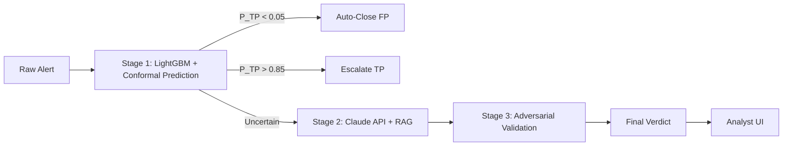

<p align="center">
  <h1 align="center">SOC False Positive Reduction</h1>
  <p align="center">A two-stage hybrid alert triage pipeline that cuts SOC false positives using ML scoring, conformal prediction, LLM reasoning, and adversarial validation.</p>
</p>

<p align="center">
  <a href="https://www.python.org/downloads/"></a>
  <a href="https://opensource.org/licenses/MIT"></a>
  <a href="https://github.com/jay-chetty-ai/soc-fp-reduction/actions"></a>
</p>

---

## What This Does

SOC analysts spend most of their time on false positives. This system automates the triage of low-confidence alerts and surfaces only the ones that matter.



**Stage 1** scores every alert with a calibrated LightGBM classifier. Conformal prediction splits alerts into three bands with statistical guarantees: auto-close, escalate, or uncertain.

**Stage 2** takes the uncertain band and reasons over it using Claude with RAG over historical alert dispositions. It outputs a structured verdict with natural language explanation.

**Stage 3** runs an adversarial validation pass (inspired by Cloudflare's Project Glasswing) that attempts to disprove Stage 2 findings before finalizing.

**Analyst UI** is a Streamlit dashboard showing alert details, SHAP explanations, LLM rationale, similar historical alerts, and feedback capture.

## Performance Targets

| Metric | Target |
|--------|--------|
| Stage 1 PR-AUC | >= 0.85 |
| Auto-FP false negative rate | <= 1% |
| True positive recall | >= 95% |
| Alert volume reduction | >= 70% |
| Stage 1 scoring latency | < 500ms/alert |
| Stage 2 LLM response time | < 10s/alert |

## Quick Start

**One-line install (macOS/Linux):**

```bash
curl -fsSL https://raw.githubusercontent.com/jay-chetty-ai/soc-fp-reduction/main/scripts/install.sh | bash
```

**One-line install (Windows PowerShell):**

```powershell
irm https://raw.githubusercontent.com/jay-chetty-ai/soc-fp-reduction/main/scripts/install.ps1 | iex
```

**Manual setup:** See [docs/setup.md](docs/setup.md) for step-by-step instructions.

## Project Structure

```
soc-fp-reduction/
├── docs/                          # Specification documents
│   ├── requirements.md            # Functional & non-functional requirements
│   ├── architecture.md            # System design & data flow
│   ├── test_plan.md               # Test specifications
│   ├── sprint_backlog.md          # Agile sprint plan
│   └── setup.md                   # Full setup guide
├── src/
│   ├── data/
│   │   ├── loader.py              # Dataset download and loading
│   │   └── features.py            # Feature engineering
│   ├── models/
│   │   ├── classifier.py          # LightGBM/XGBoost training & inference
│   │   ├── conformal.py           # Conformal prediction & band routing
│   │   └── explainer.py           # SHAP explanations
│   ├── llm/
│   │   ├── embeddings.py          # Sentence-transformer embeddings
│   │   ├── retrieval.py           # FAISS RAG retrieval
│   │   ├── adjudicator.py         # Stage 2 LLM adjudication
│   │   └── adversarial.py         # Adversarial validation agent
│   ├── pipeline/
│   │   ├── orchestrator.py        # End-to-end pipeline
│   │   └── tripwire.py            # Retroactive IOC check
│   └── ui/
│       └── dashboard.py           # Streamlit app
├── tests/
│   ├── conftest.py                # Shared fixtures
│   ├── test_epic1_data.py         # Data & classifier tests
│   ├── test_epic2_llm.py          # LLM & RAG tests
│   └── test_epic3_ui.py           # UI tests
├── scripts/
│   ├── install.sh                 # One-line install (macOS/Linux)
│   └── install.ps1                # One-line install (Windows)
├── CLAUDE.md                      # Project spec for Claude Code
├── config.yaml                    # All configuration
├── requirements.txt               # Python dependencies
└── README.md
```

## Development Process

This project follows **spec-based Agile development**:

1. **Phase 1: Specification** — Requirements, architecture, and test plan documents produced before any code
2. **Phase 2: Sprint execution** — Epics, stories, and tasks with test-gated progression
3. **Quality gates** — Every story must have passing tests before moving to the next

See [CLAUDE.md](CLAUDE.md) for the full project specification and development rules.

### Epics

| Epic | Description | Status |
|------|-------------|--------|
| 1 | Data Ingestion & Stage 1 Classifier | Not started |
| 2 | Conformal Calibration & Stage 2 LLM | Not started |
| 3 | Analyst UI & Demo | Not started |

## Tech Stack

| Component | Technology |
|-----------|-----------|
| ML Classifier | LightGBM, XGBoost, scikit-learn |
| Uncertainty | MAPIE (conformal prediction) |
| Explainability | SHAP TreeExplainer |
| Embeddings | sentence-transformers (MiniLM-L6-v2) |
| Vector Search | FAISS |
| LLM | Anthropic Claude API |
| Data | pandas, DuckDB |
| UI | Streamlit |
| Testing | pytest |

## Dataset

[CICIDS2017](https://www.unb.ca/cic/datasets/ids-2017.html) — 2.8M network flows, 78 features, 5-day capture. Temporal hold-out: train on days 1-4, test on day 5.

## License

[MIT](LICENSE)
